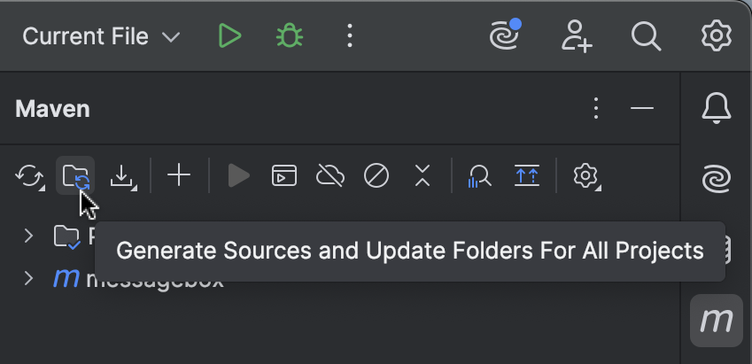

# Getting Started with Maven

## Step 1: Add the Maven Plugin

Add the Windows API Maven plugin to `<build>` / `<plugins>` section in your `pom.xml` file:

```xml
<project ...>

  ...

  <build>
    <plugins>

      <plugin>
        <groupId>net.codecrete.windows-api</groupId>
        <artifactId>windowsapi-maven-plugin</artifactId>
        <version>0.8.0</version>
        <executions>
          <execution>
            <goals>
              <goal>windows-api</goal>
            </goals>
            <configuration>
              ...
            </configuration>
          </execution>
        </executions>
      </plugin>

    </plugins>
  </build>

  ...

</project>
```

## Step 2: Configure the Plugin

Configure the Windows API functions and data structures you want to generate code for. This is done in the
`<configuration>` section of the plugin. For example, to generate code for the `MessageBoxW` function:

```xml
        <executions>
          <execution>
            <goals>
              <goal>windows-api</goal>
            </goals>
            <configuration>
              <functions>
                <function>MessageBoxW</function>
              </functions>
            </configuration>
          </execution>
```

## Step 3: Generate the Code

To generate the code, either run Maven from the command line:

```bash
mvn generate-sources
```

Or, if you are using an IDE like IntelliJ IDEA, you can generate the sources from the IDE.



The generated code will be in the `target/generated-sources/windows-api` directory.

## Step 4: Use the Generated Code

The generated code can now be used in Java or Kotlin code:

```java
var errorStateLayout = Linker.Option.captureStateLayout();

try (var arena = Arena.ofConfined()) {
    var errorState = arena.allocate(errorStateLayout);

    MessageBoxW(
            errorState,
            NULL,
            arena.allocateFrom("Hello, World!", UTF_16LE),
            arena.allocateFrom("Windows API", UTF_16LE),
            MESSAGEBOX_STYLE.MB_OKCANCEL
    );
}
```

Note that the code generator did not only generate the `MessageBoxW` function but also additional classes, e.g., the `MESSAGEBOX_STYLE` class, which is used as the last parameter.


## Next Steps

- [Maven Plugin Reference](maven_plugin.md)
- [Generated Code](generated_code.md)
